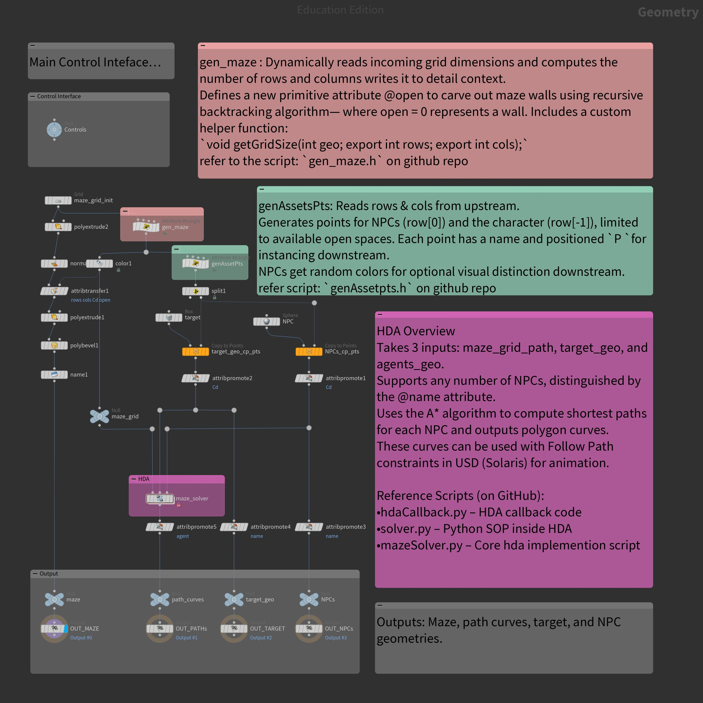
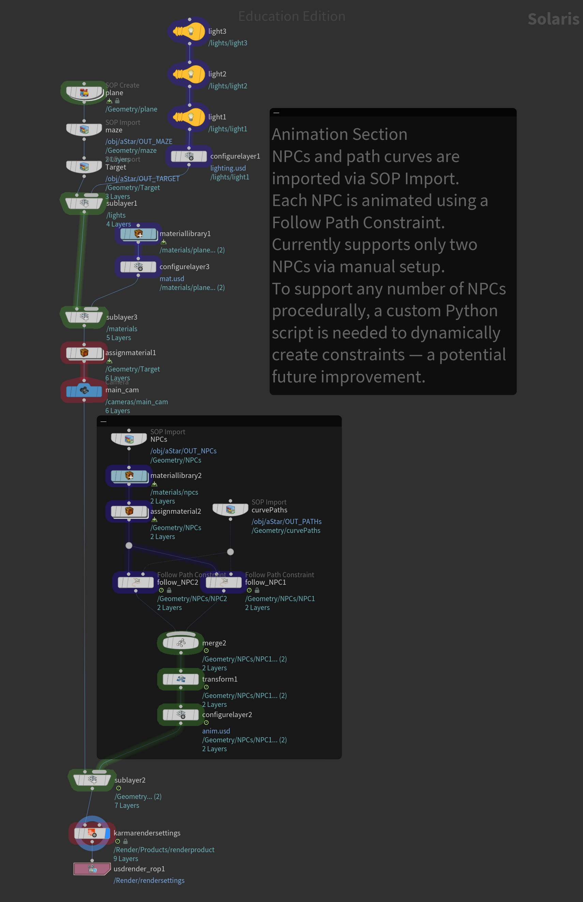

# A\* Maze Solver with Multi-Agent Animation in Houdini

## Overview

This project is an implementation of the A\* pathfinding algorithm in Houdini, extended to support multiple NPCs and animation in the Solaris (USD) context. It was developed as part of a Week 2 assignment where the original requirement demonstrated pathfinding for a single character. This implementation enhances it by supporting any number of NPC agents and animating them procedurally.

## Features

* Procedural maze generation using a recursive backtracking algorithm
* Automatic detection of grid dimensions from user-provided input
* Dynamic placement of NPCs and target geometry based on open maze paths
* A\* algorithm implementation for multi-agent pathfinding
* Outputs animation-ready path curves for each agent
* Solaris-compatible animation via Follow Path Constraints

## Screenshots

**SOP Context:**

**LOP (Solaris) Context:**

## Input Requirements

The project expects a user-provided grid mesh (a plane) of arbitrary size. NPC and Target geometries can be any geometry instanced at runtime using point attributes.

## Node Breakdown

### 1. `gen_maze` (Detail Wrangle)

* Reads incoming grid geometry
* Computes number of rows and columns using `getGridSize()`
* Generates wall layout using recursive backtracker
* Outputs:

  * `@open` primitive attribute (0 = wall, 1 = walkable)
  * `rows` and `cols` detail attributes
* Script: [`gen_maze.h`](./gen_maze.h)

### 2. `genAssetsPts` (Detail Wrangle)

* Reads `rows` and `cols` attributes
* Randomly positions:

  * One target on the last row (destination)
  * Multiple NPCs on the first row (start points)
* Ensures NPC count does not exceed number of available open positions
* Outputs:

  * Points with `@P`, `@name`, and randomized `@Cd`
* Script: [`genAssetPts.h`](./genAssetPts.h)

### 3. Geometry Instancing

* Target and NPC geometries are instanced to the generated points using the `@name` attribute
* Ensures all agents are uniquely identified for downstream processing

### 4. HDA: `maze_solver`

* Inputs:

  1. Maze grid geometry
  2. Target geometry
  3. Agents (NPCs) geometry
* Internally uses:

  * Python SOP (`solver.py`) to compute paths
  * Callback script (`hdaCallback.py`) to trigger solve + stash
  * Core solver logic (`mazeSolver.py`) implementing the A\* algorithm
* Outputs:

  * Polygon curves representing shortest paths for each NPC

## HDA Internal Scripts

* `hdaCallback.py`: Handles button press interaction and stashing results
* `solver.py`: Executes `solve_all()` and merges geometry output
* `mazeSolver.py`: Core logic to compute paths using:

  * `get_grid_data()`
  * `read_agent_cells()`
  * `read_target_cell()`
  * `build_path_geometry()`

## Solaris Animation (LOP Context)

* NPCs and path curves imported via SOP Import
* Animation done using Follow Path Constraints (manual setup for 2 NPCs)
* Future improvement: Write a Python script to generate constraints procedurally for unlimited NPCs

## Outputs

* `OUT_MAZE`: Maze geometry with open/wall distinction
* `OUT_PATHS`: Polygon curves representing NPC paths
* `OUT_TARGET`: Target geometry
* `OUT_NPCs`: Instanced NPC agents with `@name` attribute for Solaris use

## Demo Video

[Final Animation Output (YouTube)](https://youtu.be/18LnXRz6xV4?si=wO_6n1LBUDtIDtfg)

## Notes

* All scripts are modular and reusable
* Designed for educational and showcase purposes
* Clean separation between SOP and LOP logic to ensure USD compatibility

---

This README is designed for both academic submission and future reference for those exploring multi-agent systems and procedural animation in Houdini. For any questions, please refer to the provided scripts in the repository or contact the project author.

